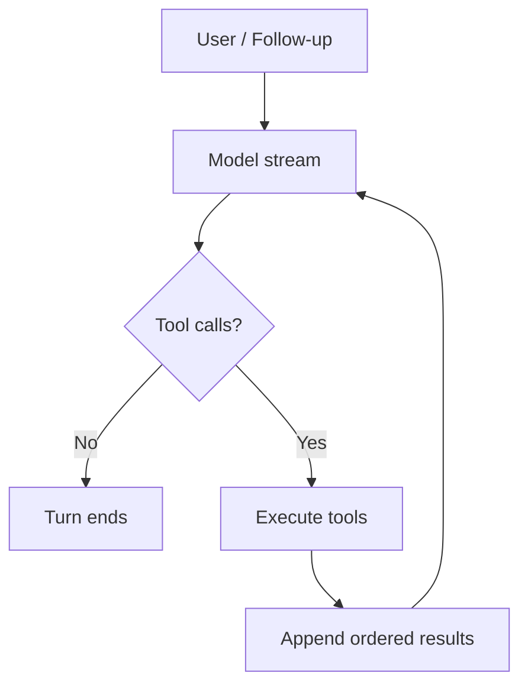

# Chapter 02 — Pi Agent Loop Anatomy

Model က “file ကိုဖတ်မယ်” လို့ Tool Call ထုတ်တယ်။ Runtime က file ကိုဖတ်ပြီး Tool Result ပြန်ပေးတယ်။ Model က result ကိုကြည့်ပြီး နောက်ဆုံးအဖြေပြန်တယ်။ အပေါ်ယံကြည့်ရင် `while` loop တစ်ခုရေးလိုက်ရုံနဲ့ ပြီးသလိုထင်ရပါတယ်။

ဒါပေမယ့် user က model စောင့်နေချိန်မှာ steering message အသစ်ပို့လိုက်ရင် ဘယ်အချိန်ထည့်မလဲ။ Tool နှစ်ခု parallel run ရင် ဘယ် result ကို အရင်ပြန်ထည့်မလဲ။ Stream အလယ်မှာ abort ဖြစ်ရင် `message_end` နဲ့ `agent_end` ထွက်သင့်သလား။ Tool arguments က output limit ကြောင့် တစ်ဝက်တစ်ပျက်ဖြစ်နေရင် execute လုပ်သင့်သလား။

Agent Loop ရဲ့ တကယ့်အလုပ်က model ကို ထပ်ခါထပ်ခါခေါ်ရုံ မဟုတ်ပါဘူး။ State နဲ့ event တွေကို အစီအစဉ်မှန်အောင် ထိန်းပေးတာပါ။

## ၂.၁ Agent Loop ဆိုတာ `while` loop တစ်ခုတည်း မဟုတ်ဘူး

Agent Loop ကို အလွယ်ဆုံးနားလည်ဖို့ orchestra conductor တစ်ယောက်လို စဉ်းစားကြည့်နိုင်ပါတယ်။ Conductor က တူရိယာကိုယ်တိုင် မတီးပေမယ့် ဘယ်သူက ဘယ်အချိန်စမလဲ၊ ဘယ်အချိန်ရပ်မလဲ၊ နောက်အပိုင်းကို ဘယ်အချိန်ကူးမလဲ ထိန်းပေးတယ်။ Agent Loop ကလည်း model နဲ့ tool ရဲ့ အလုပ်ကို ကိုယ်တိုင်မလုပ်ဘဲ execution အစီအစဉ်ကို ထိန်းပေးပါတယ်။

ဒါပေမယ့် orchestra နဲ့ လုံးဝတူတာတော့ မဟုတ်ပါဘူး။ Orchestra မှာ score က ကြိုတင်သတ်မှတ်ထားပေမယ့် Agent Runtime ရဲ့ နောက်တစ်ဆင့်က model output၊ Tool Result၊ steering message နဲ့ abort signal အပေါ်မူတည်ပြီး ပြောင်းနိုင်ပါတယ်။ ဒါကြောင့် Agent Loop က fixed workflow မဟုတ်ဘဲ stateful control flow ဖြစ်ပါတယ်။

Pi နဲ့ Travis234 source ကို concept အလိုက်ချိတ်ရင် အောက်ပါအတိုင်းမြင်နိုင်ပါတယ်။

| Concept | Pi | Travis234 |
|---|---|---|
| Outer follow-up loop | `packages/agent/src/agent-loop.ts` | `travis/agent/agent_loop.py` |
| Inner steering/tool loop | `packages/agent/src/agent-loop.ts` | `travis/agent/agent_loop.py` |
| Runtime types | `packages/agent/src/types.ts` | `travis/agent/types.py` |
| Agent owner | `packages/agent/src/agent.ts` | `travis/agent/agent.py` |

Pi မှာ `runAgentLoop()` လို့စပြီး Travis234 မှာ `run_agent_loop_async()` လို့စပါတယ်။ နာမည်နဲ့ language syntax ကွာပေမယ့် initial prompts ကို context ထဲထည့်ခြင်း၊ `agent_start` နဲ့ ပထမ `turn_start` ထုတ်ခြင်း၊ prompt message boundaries ထုတ်ခြင်းနဲ့ shared loop ကို ဝင်ခြင်းဆိုတဲ့ အစီအစဉ်က ဆင်တူပါတယ်။

ဒီ file တွေကို အခုချက်ချင်း အကုန်ဖွင့်ဖတ်ဖို့ မလိုသေးပါဘူး။ Loop ရဲ့အရိုးစုကို အရင်မြင်ထားရင် production code ထဲက hooks နဲ့ event details တွေကို နောက်မှပြန်ထည့်ဖတ်ရ ပိုလွယ်ပါတယ်။

### Loop အရိုးစုကို အရင်ကြည့်မယ်

အောက်က code က Travis234 source ကို တိုက်ရိုက်ကူးထားတာမဟုတ်ဘဲ loop နှစ်ထပ်ကိုမြင်နိုင်အောင် ချုံ့ထားတဲ့ teaching version ဖြစ်ပါတယ်။ `has_more_tool_calls` က model ဆီပြန်သွားရဦးမလားဆိုတာ မှတ်ထားပြီး `pending_messages` က နောက် model call မတိုင်ခင် ထည့်ရမယ့် steering message တွေကို ကိုင်ထားပါတယ်။

```python
while True:  # outer loop
    while has_more_tool_calls or pending_messages:  # inner loop
        add_pending_messages_to_context()
        assistant_message = await stream_assistant_response()
        tool_results = await execute_requested_tools(assistant_message)
        has_more_tool_calls = should_continue_after(tool_results)
        pending_messages = await get_steering_messages()

    follow_up = await get_follow_up_messages()
    if not follow_up:
        break
    pending_messages = follow_up
```

Inner loop ထဲမှာ model response တစ်ကြိမ်ရတိုင်း tools ဆက်ခေါ်ရမလား၊ steering message အသစ်ဝင်လာသလား ပြန်စစ်ပါတယ်။ နှစ်ခုလုံးမရှိတော့မှ outer loop ဆီထွက်လာတယ်။ Outer loop က follow-up ရှိရင် `pending_messages` ထဲပြန်ထည့်ပြီး သင်ခန်းစာတစ်ပုဒ်ပြီးမှ နောက်မေးခွန်းဆက်မေးသလို inner loop ကို ပြန်ဝင်စေပါတယ်။

ဒီ skeleton ထဲမှာ event emission၊ validation၊ abort နဲ့ hooks တွေကို မထည့်ရသေးပါဘူး။ အဲဒီအရာတွေက loop ပုံစံကိုပြောင်းတာမဟုတ်ဘဲ boundary တစ်ခုချင်းကို ပိုတိကျစေတဲ့အလွှာတွေဖြစ်ပါတယ်။ အခု outer loop နဲ့ inner loop ရဲ့တာဝန်ကွာခြားတာကို မြင်ပြီဆိုရင် production flow ကို ဆက်ဖတ်လို့ရပါပြီ။

## ၂.၂ Outer Loop — Follow-up ကို ထိန်းတဲ့အပိုင်း

Outer loop ရဲ့ အလုပ်က ရိုးရှင်းပါတယ်။ Agent က ပုံမှန်အတိုင်းဆို ရပ်တော့မယ့်အချိန်မှာ queued follow-up message ရှိသေးလားဆိုတာ စစ်ပေးတာပါ။

Assistant က Tool Call မထုတ်တော့ဘူး၊ pending steering message လည်း မရှိတော့ဘူးဆိုရင် inner loop က ပြီးပါပြီ။ ဒီအချိန်မှာ Agent က ချက်ချင်း `agent_end` မထုတ်သေးဘဲ follow-up queue ကို စစ်ပါတယ်။ Follow-up ရှိရင် pending messages အဖြစ်ပြောင်းပြီး inner loop ကို ပြန်ဝင်တယ်။ မရှိမှ outer loop က ရပ်ပါတယ်။

Follow-up ဆိုတာ လက်ရှိ turn ကို ကြားဖြတ်ပြောင်းခိုင်းတာမဟုတ်ပါဘူး။ “ဒီအလုပ်ပြီးရင် နောက်တစ်ခုဆက်လုပ်ပါ” ဆိုတဲ့သဘောနဲ့ Agent ရပ်တော့မယ့် boundary မှာ ဝင်ပါတယ်။

ဥပမာ agent က test failure ကို ရှင်းပြနေချိန်မှာ user က “ပြီးရင် fix plan တစ်ခုပါထည့်ပေး” လို့ follow-up queue ထဲထည့်ထားတယ်ဆိုပါစို့။ လက်ရှိ response နဲ့ tool chain ပြီးမှ အဲဒီ message ကို နောက် turn အဖြစ် process လုပ်ပါတယ်။ ဒီအတွက် outer loop လိုတာပါ။

## ၂.၃ Inner Loop — Steering နဲ့ Tool Execution

Inner loop က ပိုလှုပ်ရှားပါတယ်။ Tool Call ဆက်ရှိသရွေ့ သို့မဟုတ် pending steering message ရှိသရွေ့ turn အသစ်တွေကို ဆက်လုပ်ပါတယ်။

Travis234 code ထဲက `has_more_tool_calls` ကို ပထမအကြိမ် `True` ပေးထားတာက initial model response တစ်ကြိမ် မဖြစ်မနေရစေဖို့ပါ။ ပထမ turn ရဲ့ `turn_start` ကို အပြင်ဘက် `run_agent_loop_async()` က ထုတ်ပြီးသားဖြစ်လို့ `first_turn` flag နဲ့ ထပ်မထုတ်အောင် ထိန်းထားပါတယ်။ နောက် turn တွေမှာမှ inner loop က `turn_start` အသစ်ထုတ်ပါတယ်။

Turn တစ်ခုရဲ့ အဓိကအစီအစဉ်က:

1. Pending steering messages ရှိရင် context ထဲထည့်တယ်။
2. Message တစ်ခုချင်းအတွက် `message_start` နဲ့ `message_end` ထုတ်တယ်။
3. Assistant response ကို stream လုပ်တယ်။
4. Tool Calls ရှိမရှိ စစ်တယ်။
5. ရှိရင် validation နဲ့ execution လုပ်ပြီး Tool Results ပြန်တည်ဆောက်တယ်။
6. Tool Results ကို context နဲ့ new-message list ထဲထည့်တယ်။
7. `turn_end` ထုတ်တယ်။
8. Abort၊ stop hook နဲ့ steering queue ကို စစ်တယ်။

Steering က follow-up နဲ့မတူပါဘူး။ Steering message ကို assistant response နောက် turn မစခင် စစ်ပြီး context ထဲထည့်ပါတယ်။ Tool chain ဆက်ရှိနေချိန်မှာ user က “အဲဒီ file ကိုမပြင်နဲ့၊ analysis ပဲလုပ်” လို့ပို့လိုက်ရင် နောက် model call မတိုင်ခင် direction အသစ်အဖြစ် ဝင်နိုင်ပါတယ်။

ဒီနေရာမှာ steering က လက်ရှိ run နေတဲ့ tool ကို အလိုအလျောက်ပြန်ရုပ်သိမ်းမယ်လို့ မယူဆသင့်ပါဘူး။ Running work ကို ချက်ချင်းရပ်ဖို့ cancellation သို့မဟုတ် abort mechanism သီးခြားလိုပါတယ်။ Steering ရဲ့အဓိက boundary က next assistant response ဖြစ်ပါတယ်။

## ၂.၄ Assistant Stream က Event ဘယ်လိုဖြစ်လာသလဲ

Model response ကို UI မှာ စာလုံးတွေ တဖြည်းဖြည်းပေါ်လာတာပဲ streaming လို့ မမြင်သင့်ပါဘူး။ Runtime ဘက်ကကြည့်ရင် partial message တစ်ခုကို final message ဖြစ်လာအောင် အဆင့်ဆင့် update လုပ်နေတဲ့ state transition ဖြစ်ပါတယ်။

ပုံမှန် text turn တစ်ခုရဲ့ event sequence ကို ချုံ့ကြည့်ရင်:

```text
agent_start
turn_start
message_start  (user)
message_end    (user)
message_start  (assistant partial)
message_update (text/thinking/tool-call deltas)
message_end    (assistant final)
turn_end
agent_end
```

Provider stream က `start` event ပေးတဲ့အခါ partial assistant message ကို context ထဲ စတင်ထည့်ပြီး `message_start` ထုတ်ပါတယ်။ Text delta၊ thinking delta နဲ့ Tool Call delta တွေရလာတိုင်း နောက်ဆုံး partial snapshot ကို update လုပ်ပြီး `message_update` ထုတ်ပါတယ်။ `done` သို့မဟုတ် `error` boundary ရောက်မှ final assistant message နဲ့အစားထိုးပြီး `message_end` ထုတ်ပါတယ်။

Provider adapter တစ်ခုက explicit start event မပေးဘဲ final result ပဲပြန်လာတာမျိုးလည်း ရှိနိုင်ပါတယ်။ အဲဒီအခါ loop က final message အတွက် `message_start` ကို အရင်ထုတ်ပြီးမှ `message_end` ထုတ်တယ်။ ဒါကြောင့် UI နဲ့ logger လို event ကိုသုံးတဲ့အပိုင်းတွေက assistant message တစ်ခုမှာ start/end boundary ရှိမယ်ဆိုတာ ဆက်ယုံကြည်နိုင်ပါတယ်။

Stream အလယ်မှာ abort ဖြစ်ရင် Travis234 က response ကိုပိတ်ဖို့ကြိုးစားပြီး partial state ကို aborted final message အဖြစ် ပြောင်းပေးပါတယ်။ ဒီအပိုင်းကို UI concern လို့ပဲ မယူဆသင့်ပါဘူး။ Partial message ကို context ထဲဘယ်လိုထားခဲ့မလဲဆိုတာ နောက် request ရဲ့ state ကို တိုက်ရိုက်သက်ရောက်ပါတယ်။

## ၂.၅ Tool Result ပြန်ဝင်လာတဲ့အစီအစဉ်

Assistant final message ထဲမှာ Tool Calls ပါလာရင် loop က tool batch ကို ပြင်ဆင်ပါတယ်။ Unknown tool၊ invalid arguments သို့မဟုတ် before-hook ကပိတ်ထားတဲ့ call တွေဟာ tool body မ run ဘဲ immediate error outcome ဖြစ်နိုင်ပါတယ်။ Valid call တွေကတော့ sequential သို့မဟုတ် parallel mode အတိုင်း execute လုပ်ပါတယ်။

Tool နှစ်ခု parallel run တဲ့အခါ “ဘယ်ဟာအရင်လဲ” ဆိုတဲ့မေးခွန်းကို တစ်မျိုးတည်းဖြေလို့ မရပါဘူး။ Start လုပ်တဲ့ order၊ တကယ်ပြီးတဲ့ order နဲ့ result ပြန်ထည့်တဲ့ order ဆိုပြီး ခွဲကြည့်ရပါတယ်။

| Order | အဓိပ္ပာယ် |
|---|---|
| Source order | Model က Tool Calls ထုတ်ပေးခဲ့တဲ့အစီအစဉ် |
| Start order | Coordinator က execution စဝင်ခွင့်ပေးတဲ့အစီအစဉ် |
| Completion order | Tool တစ်ခုချင်း တကယ်ပြီးသွားတဲ့ wall-clock အစီအစဉ် |
| Result order | Model context ထဲ Tool Result messages ပြန်ထည့်တဲ့အစီအစဉ် |

Parallel mode မှာ slow tool ကိုအရင်ခေါ်ပြီး fast tool ကိုနောက်မှခေါ်ထားပေမယ့် fast tool က အရင်ပြီးနိုင်ပါတယ်။ `tool_execution_end` event က completion order ကို ထင်ဟပ်နိုင်ပါတယ်။ ဒါပေမယ့် Tool Result messages ကို context ထဲပြန်ထည့်တဲ့အခါ source order ကို ထိန်းထားပါတယ်။

ဒါက event order နဲ့ message order မတူနိုင်ကြောင်း ပြတဲ့အရေးကြီးဆုံးဥပမာပါ။ UI သို့မဟုတ် observability layer က completion event ကို အချိန်နဲ့တစ်ပြေးညီမြင်ချင်တယ်။ Model ကတော့ သူထုတ်ခဲ့တဲ့ Tool Calls နဲ့ Tool Results ကို stable order နဲ့ပြန်မြင်ဖို့လိုပါတယ်။ Runtime က ဒီလို consumer နှစ်မျိုးရဲ့လိုအပ်ချက်ကို ခွဲထိန်းရပါတယ်။

Sequential/parallel selection၊ validation၊ hooks နဲ့ bounded worker pool ကို Chapter 05 မှာ အသေးစိတ်ပြန်ကြည့်ပါမယ်။ အခုတော့ Tool Execution ပြီးတာနဲ့ result ကို context ထဲ ချက်ချင်းပစ်ထည့်တာမဟုတ်ဘဲ batch ordering rule တစ်ခုကနေ ပြန်စီပေးတယ်ဆိုတာ မြင်ရင်ရပါပြီ။

## ၂.၆ Execution Flow ကို တစ်ပုံတည်းနဲ့ကြည့်ခြင်း



ဒီပုံက အလုပ်ပုံမှန်သွားတဲ့ လမ်းကြောင်းကိုပဲ ချုံ့ပြထားပါတယ်။ Steering message၊ context transform၊ validation failure၊ hooks၊ cancellation နဲ့ `prepare_next_turn` ကို မထည့်ထားပါဘူး။ Implementation အပြည့်အစုံအဖြစ် မယူဘဲ “model → tools → ordered results → model” ဆိုတဲ့ အဓိက flow ကို မြင်ဖို့သုံးရမှာပါ။

### Event trace ကို အစဉ်လိုက်ဖတ်ကြည့်ခြင်း

Model က `read_file` တစ်ခုပဲခေါ်ပြီး နောက် response မှာ final answer ပြန်တယ်ဆိုပါစို့။ Trace ကို turn boundary နဲ့ခွဲရင်:

```text
Turn 1
  user message
  assistant message containing read_file call
  tool_execution_start
  tool_execution_end
  toolResult message
  turn_end

Turn 2
  turn_start
  assistant final message
  turn_end
  agent_end
```

Tool Result က Turn 1 ထဲမှာရှိပေမယ့် အဲဒီ result ကိုဖတ်ပြီးရေးတဲ့ assistant answer က Turn 2 မှာထွက်ပါတယ်။ Tool ကို execute လုပ်ပြီး result ပြန်ရရုံနဲ့ model က result ကို သိပြီးသားမဟုတ်ပါဘူး။ Result ပါတဲ့ context နဲ့ model ကို နောက်တစ်ကြိမ်ခေါ်မှ သိတာပါ။

## ၂.၇ ဘယ်အချိန်မှာ Loop ရပ်သလဲ

ပုံမှန် text response တစ်ခုမှာ Tool Call မပါရင် inner loop ရပ်ဖို့အဆင်သင့်ဖြစ်ပါတယ်။ Pending steering မရှိ၊ outer loop မှာ follow-up မရှိရင် `agent_end` နဲ့ အဆုံးသတ်ပါတယ်။

အခြား stop paths တွေလည်းရှိပါတယ်။

- Assistant message ရဲ့ stop reason က `error` သို့မဟုတ် `aborted` ဖြစ်ခြင်း
- Abort signal ကို runtime က တွေ့ခြင်း
- `should_stop_after_turn` hook က ရပ်ခိုင်းခြင်း
- Tool batch အားလုံးက terminate outcome ပြန်ခြင်း
- Tool Calls မရှိတော့ဘဲ queued message လည်းမရှိခြင်း

`prepare_next_turn` hook ကတော့ stop hook မဟုတ်ပါဘူး။ နောက် turn အတွက် context၊ model သို့မဟုတ် reasoning level ပြောင်းပေးနိုင်တဲ့ boundary ဖြစ်ပါတယ်။ ပြီးမှ `should_stop_after_turn` နဲ့ steering queue ကို စစ်ပါတယ်။ ဒီအစီအစဉ်က hook နှစ်ခုကို တူတူထင်မိတာကနေ ကာကွယ်ပေးပါတယ်။

Output token limit ကြောင့် assistant message က `length` နဲ့ရပ်ပြီး Tool Call arguments တစ်ဝက်တစ်ပျက်ဖြစ်နိုင်ရင် Pi နဲ့ Travis234 က အဲဒီ calls တွေကို execute မလုပ်ဘဲ error Tool Results အဖြစ် fail closed လုပ်ပါတယ်။ JSON parse လို့ရသေးတာတစ်ခုတည်းနဲ့ arguments ပြည့်စုံတယ်လို့ မဆိုနိုင်လို့ပါ။

## ၂.၈ Failure Modes

### `turn_start` ကို နှစ်ခါထုတ်မိခြင်း

Wrapper က initial `turn_start` ထုတ်ပြီး inner loop ကလည်း ပထမ pass မှာ ထပ်ထုတ်မိရင် consumer တွေအတွက် turn နှစ်ခုရှိသလို ဖြစ်သွားနိုင်ပါတယ်။ Pi နဲ့ Travis234 က `firstTurn`/`first_turn` state နဲ့ ဒီ boundary ကို ထိန်းထားပါတယ်။

### Completion order ကို Result order အဖြစ်သုံးမိခြင်း

Parallel tool အမြန်ပြီးတဲ့အစီအစဉ်နဲ့ Tool Results ပြန်ထည့်လိုက်ရင် model ထုတ်ခဲ့တဲ့ call order နဲ့ context order ကွာသွားနိုင်ပါတယ်။ Debugging ခက်သွားသလို provider သို့မဟုတ် transcript consumer က stable pairing မရနိုင်ပါဘူး။ Completion events ကို live ထုတ်နိုင်ပေမယ့် result messages ကို source order နဲ့ ပြန်တည်ဆောက်ရပါတယ်။

### Steering နဲ့ cancellation ကို ရောထွေးခြင်း

Steering message ရှိတာနဲ့ လက်ရှိ tool ရပ်သွားမယ်လို့ယူဆရင် destructive operation တစ်ခုကို အချိန်မီတားနိုင်မယ်လို့ မှားယွင်းယုံကြည်မိနိုင်ပါတယ်။ Steering က နောက် model boundary အတွက် direction ဖြစ်ပြီး running work ကိုရပ်ဖို့ abort/cancellation path သီးခြားလိုပါတယ်။

### Truncated Tool Call ကို execute လုပ်ခြင်း

Output limit ရောက်သွားတဲ့ Tool Call ရဲ့ arguments က valid JSON လိုမြင်ရပေမယ့် အရေးကြီးတဲ့နောက်ပိုင်း field ပျောက်နေနိုင်ပါတယ်။ ဒီ call ကို run လိုက်ရင် incomplete intent နဲ့ mutation ဖြစ်နိုင်လို့ fail closed လုပ်တာ ပိုလုံခြုံပါတယ်။

## ၂.၉ အနှစ်ချုပ်

- Agent Loop က `while` loop သက်သက်မဟုတ်ဘဲ state၊ event နဲ့ execution boundary ကို ထိန်းတဲ့ control flow ဖြစ်တယ်။
- Outer loop က Agent ရပ်တော့မယ့်အချိန်မှာ follow-up messages ကို စစ်တယ်။
- Inner loop က Tool Calls နဲ့ steering messages ဆက်ရှိသရွေ့ turn အသစ်တွေကို ဆက်လုပ်တယ်။
- Assistant streaming မှာ `message_start` → `message_update` → `message_end` boundary ရှိတယ်။
- Parallel Tool Execution မှာ completion order နဲ့ Tool Result source order မတူနိုင်တယ်။
- Loop က text completion တစ်ခုတည်းကြောင့်မဟုတ်ဘဲ abort၊ error၊ stop hook၊ terminate outcome နဲ့ queue state တွေအပေါ်မူတည်ပြီး ရပ်တယ်။

## ၂.၁၀ Source Notes

ဒီ chapter က အောက်ပါ claims နဲ့ pinned source IDs ကို အသုံးပြုထားပါတယ်။

- `C-LOOP-ORDER` — `P-LOOP`, `T-LOOP`
- `C-RESULT-ORDER` — `P-LOOP`, `T-LOOP`, `pi.loop.parallel_result_source_order`
- Runtime types — `P-TYPES`, `T-TYPES`
- Agent owner — `P-AGENT`, `T-AGENT`

Research revisions:

- Pi: `1f0dbc008c9b3e88017d42e8a1b46d416ad2b6b6`
- Travis234: `68b1831691b8ec93f9550ce63b80cdcb7a591b2e`

Exact links ကို [Pinned Source Map](../references/SOURCE_MAP.md) မှာ ကြည့်နိုင်ပါတယ်။ Verification boundary ကို [Technical Claim Ledger](../references/CLAIM_LEDGER.md) မှာ ဖတ်နိုင်ပါတယ်။

---

Previous: [Chapter 01 — Pi နဲ့ Hermes ကို ဘာကြောင့် တွဲကြည့်ရတာလဲ](01-why-pi-and-hermes.md)

Next: [Chapter 03 — Agent Runtime Loop ကို အစအဆုံးဖတ်ခြင်း](03-agent-runtime-loop-walkthrough.md)
