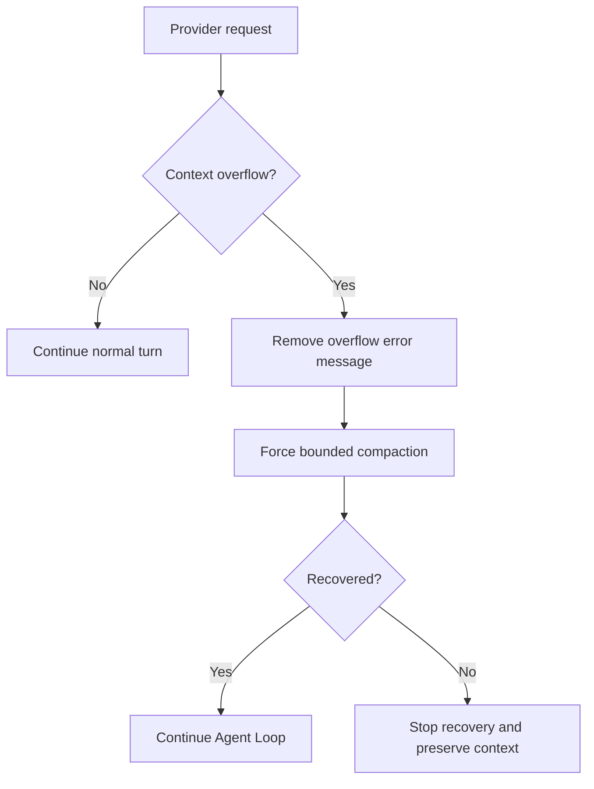
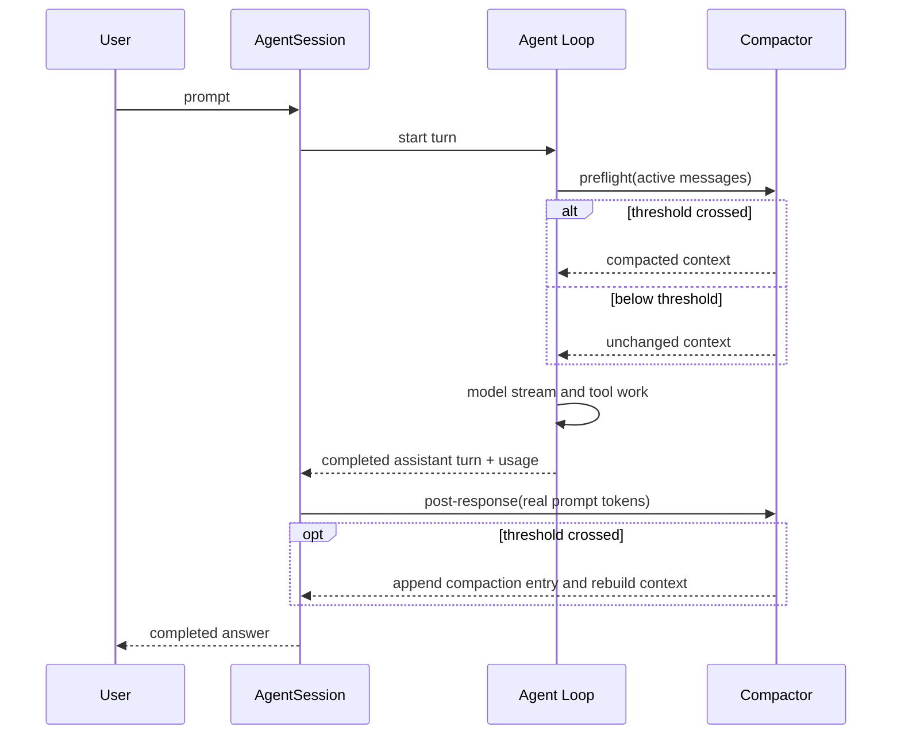

# Chapter 08 — Pi နဲ့ Hermes တွေ့ဆုံရာ

Agent Loop က model ကိုခေါ်ပြီး Tool Results ပြန်ထည့်ကာ အလုပ်ဆက်လုပ်နိုင်ပါတယ်။ Compactor က conversation အဟောင်းကို summary ပြောင်းပြီး Context Window ကို လျှော့နိုင်ပါတယ်။ နှစ်ခုစလုံး သီးခြားအလုပ်လုပ်တတ်ပေမယ့် အချိန်မှန်မှာ မဆုံရင် Runtime က မပြည့်စုံသေးပါဘူး။

Compaction စောလွန်းရင် မလိုအပ်ဘဲ summary ပြန်ရေးနေမယ်။ နောက်ကျလွန်းရင် provider က request ကို လက်မခံတော့ဘူး။ Tool chain အလယ်မှာ context ကို မှားပြောင်းမိရင် လက်ရှိ run ရဲ့ state ပျက်နိုင်တယ်။ Summary ရပြီးနောက် Agent Loop ကို ပြန်မဆက်ပေးရင်လည်း user အလုပ်က အလယ်မှာရပ်နေပါမယ်။

ဒါကြောင့် ဒီ chapter ရဲ့မေးခွန်းက “Compaction ဘယ်လိုလုပ်သလဲ” မဟုတ်တော့ပါဘူး။ “Agent ရဲ့အလုပ်ဘယ်အချိန်မှာ ခဏရပ်ပြီး၊ ဘယ် context ကိုချုံ့ကာ၊ ဘယ်နေရာကနေ ပြန်ဆက်သလဲ” ဆိုတာပါ။ Pi ကနေရလာတဲ့ loop semantics နဲ့ Hermes ကနေရလာတဲ့ compaction semantics ဟာ ဒီ lifecycle boundary မှာ ဆုံပါတယ်။

## ၈.၁ Model မခေါ်ခင်နဲ့ အဖြေရပြီးနောက်

စာတစ်စောင်ပို့မယ့်အချိန်မှာ စာအိတ်ထဲ ဆံ့မဆံ့ကို မပို့ခင် စစ်လို့ရပါတယ်။ ပို့ပြီးနောက်မှာလည်း တကယ်သုံးသွားတဲ့ အလေးချိန်ကို receipt ကနေ ပြန်သိနိုင်ပါတယ်။ Context ကို စစ်တဲ့အခါလည်း ဒီအချိန်နှစ်ခုလုံး အသုံးဝင်ပါတယ်။

Travis234 ရဲ့ normal turn ကို ချုံ့ကြည့်ရင်:

```python
# simplified teaching version
def run_user_turn(user_message):
    answer = agent_loop(
        user_message,
        transform_context=compact_before_provider_request,
    )
    compact_after_successful_turn(answer.usage)
    return answer
```

`compact_before_provider_request` က model ဆီပို့တော့မယ့် active messages ကို ကြိုစစ်ပါတယ်။ ဒါကို preflight path လို့ခေါ်ပါတယ်။ Agent Loop ပြီးပြီး assistant answer ကောင်းကောင်းရလာတဲ့နောက် `answer.usage` ကိုကြည့်ပြီး စစ်တာက post-response path ဖြစ်ပါတယ်။

ဒီ code က concept ကိုမြင်ဖို့ ချုံ့ထားတာပါ။ Production flow မှာ Tool Calls၊ streaming၊ error recovery၊ session store နဲ့ extension hooks တွေ ထပ်ပါပါတယ်။ ဒါပေမယ့် အဓိက boundary က ရှင်းပါတယ်—preflight က ကြိုတင်ကာကွယ်ပြီး post-response က တကယ့်အသုံးပြုမှုနဲ့ ပြန်စစ်ပါတယ်။

## ၈.၂ Preflight — Request မပို့ခင် ကြိုစစ်ခြင်း

Preflight Compaction ဆိုတာ provider request မပို့ခင် လက်ရှိ context ရဲ့ rough token estimate ကို စစ်ပြီး၊ threshold ကျော်နေပြီဆိုရင် အရင်ချုံ့ခြင်းပါ။ Travis234 မှာ Agent Loop ရဲ့ context transform boundary ကနေ ဒီစစ်ဆေးမှုဝင်လာပါတယ်။ ဒါကြောင့် user turn အစမှာသာမက Tool Result နဲ့ model ကို ဆက်ခေါ်မယ့် boundary မှာပါ model ဆီပို့တော့မယ့် context ကို စစ်နိုင်ပါတယ်။

Preflight ရဲ့ input က AgentSession ထဲမှာ လက်ရှိရှိနေတဲ့ messages ပါ။ Compaction မလိုသေးရင် အဲဒီ list ကို မပြောင်းဘဲ ဆက်ပို့တယ်။ လိုလာရင် head + summary + tail ပုံစံပြန်တည်ဆောက်ပြီး Agent Loop က အဲဒီ context နဲ့ provider ကို ဆက်ခေါ်ပါတယ်။ User က command အသစ်ထပ်ပေးစရာ မလိုပါဘူး။

Persistent session ရှိရင် summary စာသားတစ်ခုတည်းကို memory ထဲထားတာမဟုတ်ပါဘူး။ Session store ထဲ compaction entry အသစ်ထည့်ပြီး summary၊ ချုံ့မလုပ်ခင် token estimate၊ recent raw suffix စမယ့် entry anchor နဲ့ details တွေကို မှတ်ထားပါတယ်။ ပြီးမှ store ကနေ active context ကို ပြန်တည်ဆောက်ပါတယ်။ Persistent store မရှိတဲ့ session ဆိုရင်တော့ in-memory message list ကို compacted list နဲ့ အစားထိုးပါတယ်။

Preflight estimate က provider usage ထက် မြင့်နေတတ်ရင် compaction ပြီးပြီးချင်း ထပ် trigger ဖြစ်နိုင်ပါတယ်။ ဒါကြောင့် Compaction တစ်ကြိမ်ပြီးနောက် real usage မရသေးသရွေ့ preflight ကို ခဏ defer လုပ်နိုင်ပါတယ်။ “ကြိုတင်ခန့်မှန်းချက်” ကို “အမှန်တကယ်တိုင်းတာချက်” နဲ့ပြန်စစ်ဖို့ စောင့်တာပါ။

## ၈.၃ Post-response — တကယ်သုံးသွားတာကို ပြန်စစ်ခြင်း

Provider က successful assistant response ပြန်ပေးတဲ့အခါ usage ထဲမှာ prompt tokens ပါလာနိုင်ပါတယ်။ Post-response path က ဒီ real prompt usage ကို threshold နဲ့တိုက်ပါတယ်။ Estimate မှားနေလို့ preflight မလုပ်ခဲ့ရတာ၊ Tool Results ကြောင့် turn အတွင်း context မြန်မြန်ကြီးသွားတာတို့ကို ဒီအချိန်မှာ ပြန်ဖမ်းနိုင်ပါတယ်။

Error သို့မဟုတ် aborted assistant message ကိုတော့ normal post-response compaction အဖြစ် မယူပါဘူး။ အဲဒီ response ရဲ့ usage နဲ့ state ကို successful turn တစ်ခုလို ယုံမရလို့ပါ။ Error context နဲ့ overflow အတွက် သီးခြား recovery path ရှိပါတယ်။

Post-response Compaction လုပ်လိုက်ရင် user ဆီပေးပြီးသားအဖြေကို ပြန်ဖျက်တာမဟုတ်ပါဘူး။ CodingApp က completed turn messages ကို compaction boundary မတိုင်ခင် သီးခြားမှတ်ထားပြီး၊ active session context ကိုတော့ နောက် turn အတွက် compact လုပ်ပါတယ်။ User က လက်ရှိအဖြေကိုမြင်ရပြီး နောက်မေးခွန်းမှာ summary ပါတဲ့ context ကို model က ရပါတယ်။

Persistent session ရှိရင် preflight နည်းတူ compaction entry ကို append လုပ်ပြီး active context ကို store ကနေပြန်တည်ဆောက်ပါတယ်။ Compaction မလိုရင် ဘာမှမပြောင်းပါဘူး။ Post-response evaluation ပြီးတိုင်း overflow attempt counter ကိုလည်း reset လုပ်တာကြောင့် အရင် turn က recovery attempt ကို နောက် normal turn ဆီ မသယ်သွားပါဘူး။

## ၈.၄ Overflow Recovery — မဆံ့တော့မှ ပြန်ကယ်ခြင်း

Preflight နဲ့ post-response က overflow မဖြစ်အောင် ကြိုကာကွယ်ပေးပါတယ်။ ဒါပေမယ့် provider tokenizer က estimate နဲ့ကွာတာ၊ Tool Result အလွန်ကြီးတာ သို့မဟုတ် model capacity metadata မမှန်တာကြောင့် request ကို provider က “context too large” လို့ ပြန်ငြင်းနိုင်ပါတယ်။ ဒီအချိန်မှာ normal retry ကို တန်းလုပ်ရင် တူညီတဲ့ payload ကို ပြန်ပို့မိမှာပါ။

Overflow Recovery က failed assistant error message ကို model context ကနေ အရင်ဖယ်ပါတယ်။ ပြီးမှ Compaction ကို force လုပ်ပြီး compacted context နဲ့ Agent ကို `continue` လုပ်ပါတယ်။ Force path ဖြစ်လို့ normal threshold နဲ့ cooldown ကိုပဲစောင့်မနေပါဘူး။ ဒါပေမယ့် retry ကို အကန့်အသတ်မဲ့မလုပ်ဘဲ default အားဖြင့် compaction recovery attempt သုံးကြိမ်ထိ ကန့်သတ်ထားပါတယ်။



Compaction transaction မပြီးခင် Agent ကို ပြန်မဆက်ပါဘူး။ Lifecycle event အစီအစဉ်က compaction result ကို apply လုပ်ခြင်း၊ `compaction_end` ထုတ်ခြင်း၊ ပြီးမှ `continue` ခေါ်ခြင်း ဖြစ်ပါတယ်။ ဒီ order ကြောင့် retried provider request က အဟောင်း context ကို မတော်တဆပြန်သုံးမိတာကို ရှောင်နိုင်ပါတယ်။

Recovery မအောင်မြင်ရင် `continue` ကိုမခေါ်ပါဘူး။ Summary failure ကြောင့် transcript ကိုထိန်းထားတာ၊ protected context ကို ထပ်မချုံ့နိုင်တာနဲ့ attempt limit ပြည့်တာတို့ကို infinite retry နဲ့ မဖုံးထားပါဘူး။ Failure ကို failure အဖြစ်ထားပြီး caller က user ကို အသိပေးနိုင်ရပါတယ်။

## ၈.၅ Manual Compaction — User က ကိုယ်တိုင်ချုံ့ခြင်း

တခါတလေ threshold မရောက်သေးပေမယ့် အလုပ်တစ်ပိုင်းပြီးသွားလို့ context ကို သန့်ရှင်းချင်နိုင်ပါတယ်။ ဒါမှမဟုတ် summary failure cooldown ရှိနေပေမယ့် configuration ပြင်ပြီး ပြန်ကြိုးစားချင်နိုင်ပါတယ်။ ဒီအတွက် manual `/compact` path ရှိပါတယ်။

Manual Compaction က force လုပ်တာဖြစ်လို့ active cooldown ကိုရှင်းပြီး ပြန်ကြိုးစားနိုင်ပါတယ်။ Focus instruction တစ်ခုနဲ့ summary ကို ဦးတည်ခိုင်းနိုင်သလို၊ ပိုနက်တဲ့ handoff mode ကိုလည်း သီးခြားရွေးနိုင်ပါတယ်။ ဒီစာအုပ်မှာတော့ normal Compaction lifecycle ကိုပဲ အဓိကထားပြီး deep checkpoint အသေးစိတ်ကို မချဲ့တော့ပါဘူး။

Manual command နဲ့ active Agent run တစ်ခု တစ်ပြိုင်နက်ဝင်လာရင် context list ကို နှစ်ဖက်လုံးပြင်ခွင့်မပေးပါဘူး။ Coordinator က run lease ကို စစ်တယ်။ အခြား thread က run နေတာဆိုရင် abort signal ပေးပြီး run ပြီးမယ့်အချိန်ကို ကန့်သတ်ထားတဲ့ timeout နဲ့စောင့်တယ်။ လက်ရှိ run ပိုင်တဲ့ thread ကိုယ်တိုင် manual compaction ခေါ်မိရင်တော့ active run ပြီးမှလုပ်ဖို့ deferred error ပြန်ပေးပါတယ်။

Manual Compaction အောင်မြင်ပြီးနောက် model ကို အလိုအလျောက်မခေါ်ပါဘူး။ Summary နဲ့ active context ကို apply လုပ်ပြီး status ပြန်ပေးပါတယ်။ နောက် user prompt သို့မဟုတ် explicit continue ဝင်မှ Agent Loop က compacted context နဲ့ ပြန်စပါတယ်။ Overflow path နဲ့ ဒီနေရာမှာကွာပါတယ်—overflow က မပြီးသေးတဲ့ request ကိုကယ်နေတာဖြစ်လို့ recovery အောင်မြင်တာနဲ့ `continue` လုပ်ပါတယ်။

## ၈.၆ ပုံမှန် Lifecycle ကို တစ်ပုံတည်းနဲ့ကြည့်ခြင်း

Normal successful turn မှာ preflight နဲ့ post-response တို့ ဘယ်နေရာဝင်သလဲကို အောက်က sequence diagram နဲ့ကြည့်နိုင်ပါတယ်။ Diagram က extension hooks နဲ့ streaming delta တစ်ခုချင်းကို မထည့်ဘဲ boundary အဓိကကိုပဲ ပြထားပါတယ်။



ဒီပုံထဲမှာ preflight က Agent Loop အတွင်း provider boundary နဲ့နီးပြီး post-response က completed turn ကို AgentSession ပြန်ပိုင်တဲ့အချိန်မှာရှိပါတယ်။ Compactor က model သို့မဟုတ် tool ကို ကိုယ်တိုင်မခေါ်ပါဘူး။ ဘယ် context နဲ့ loop ဆက်ပြေးမလဲဆိုတာ ပြောင်းပေးပါတယ်။

## ၈.၇ Persist လုပ်တာက Summary တစ်ကြောင်းတည်း မဟုတ်ဘူး

Session ရှည်ရှည်ကို နောက်နေ့ပြန်ဖွင့်တဲ့အခါ memory ထဲက compacted list မရှိတော့ပါဘူး။ ဒါကြောင့် persistent session မှာ Compaction ရလဒ်ကို ပြန်တည်ဆောက်နိုင်မယ့် record လိုပါတယ်။

Compaction entry တစ်ခုမှာ အဓိကအားဖြင့်:

- structured summary၊
- compaction မတိုင်ခင် token estimate၊
- raw suffix ကို ဘယ် entry ကနေ ပြန်ဆက်ရမလဲဆိုတဲ့ `firstKeptEntryId`၊
- read/modified files၊ summary model provenance နဲ့ cooldown လို details တွေ ပါနိုင်ပါတယ်။

Store က အရင် branch entries အားလုံးကို နေရာတကျပြန်ရေးပစ်မယ့်အစား compaction entry အသစ်ကို append လုပ်ပါတယ်။ Context ပြန်တည်ဆောက်တဲ့အခါ latest compaction summary နဲ့ ထိန်းထားတဲ့ suffix ကို သုံးပါတယ်။ ဒီနည်းကြောင့် active model context က တိုသွားပေမယ့် session lineage နဲ့ compaction boundary ကို store က ဆက်သိနိုင်ပါတယ်။

ဒါပေမယ့် persisted record ရှိတာနဲ့ အမြဲမှန်မယ်လို့ မဆိုလိုပါဘူး။ Summary က stale ဖြစ်နိုင်တယ်။ `firstKeptEntryId` မှားရင် recent suffix လွဲနိုင်တယ်။ Cooldown state ကို resume အပြီးမပြန်တင်ရင် failed summarizer ကို ချက်ချင်းထပ်ခေါ်နိုင်တယ်။ Travis234 adapter က compaction entry append ပြီးတာနဲ့ store ကနေ context ပြန် build လုပ်ပြီး active state နဲ့ persisted state ကို တစ်နေရာတည်းကနေ ပြန်ညှိပါတယ်။

## ၈.၈ မှားလွယ်တဲ့ Lifecycle များ

### Turn တိုင်း Compaction လုပ်ခြင်း

Summary model ခေါ်ရတဲ့ latency နဲ့ information loss က စုပေါင်းကြီးလာပါတယ်။ Threshold၊ real usage feedback နဲ့ anti-thrashing guard တွေကို အတူသုံးရပါတယ်။

### Summary ကို အကြောင်းမဲ့ပြန်ရေးခြင်း

Protected recent context မပြောင်းသေးဘဲ summary ကို ထပ်ခါထပ်ခါ update လုပ်ရင် token မလျှော့ဘဲ detail ပဲပျောက်နိုင်ပါတယ်။ Context မပြောင်းတဲ့ no-op ကို ခွဲသိရပါတယ်။

### Persisted context နဲ့ in-memory context ကွဲခြင်း

Summary ကို memory ထဲပဲပြောင်းပြီး store မရေးထားရင် session resume အပြီး raw history အဟောင်းပြန်ပေါ်နိုင်ပါတယ်။ Store ရေးပြီး memory state မပြန် build ရင်လည်း လက်ရှိ run နဲ့ နောက် resume က context မတူနိုင်ပါတယ်။

### Overflow ကို normal retry လုပ်ခြင်း

Payload မပြောင်းဘဲ request ကိုပြန်ပို့ရင် error တူတူပြန်ရပါမယ်။ Failed overflow message ကိုဖယ်၊ context ကိုချုံ့၊ retry count ကိုကန့်သတ်ပြီးမှ ပြန်ဆက်ရပါတယ်။

### Active run နဲ့ Manual Compaction ပြိုင်ခြင်း

Model stream သို့မဟုတ် tool work လုပ်နေချိန် message list ကို တစ်ဖက်က compact လုပ်ရင် event နဲ့ context state ကွဲနိုင်ပါတယ်။ Run lease၊ abort နဲ့ wait boundary မရှိဘဲ manual mutation မလုပ်သင့်ပါဘူး။

## ၈.၉ အနှစ်ချုပ်

- Preflight က provider request မတိုင်ခင် rough estimate နဲ့ context ကို ကြိုစစ်တယ်။
- Post-response က successful turn နောက် real prompt usage နဲ့ ထပ်စစ်ပြီး နောက် turn အတွက် context ကိုပြင်တယ်။
- Overflow Recovery က failed error message ကိုဖယ်ပြီး forced၊ bounded Compaction လုပ်ကာ transaction ပြီးမှ Agent Loop ကို `continue` လုပ်တယ်။
- Manual Compaction က user-controlled force path ဖြစ်ပြီး active run နဲ့မပြိုင်အောင် lease boundary သုံးတယ်။
- Persistent session မှာ compacted list ကိုသာသိမ်းတာမဟုတ်ဘဲ summary၊ suffix anchor၊ token estimate နဲ့ details ပါတဲ့ entry ကို append လုပ်တယ်။
- Pi ရဲ့ loop က execution ကိုဆက်စေပြီး Hermes-style Compaction က ဆက်ဖတ်ရမယ့် context ကို ပြန်တည်ဆောက်ပေးတယ်။ နှစ်ခုဆုံတဲ့နေရာက model request lifecycle ဖြစ်တယ်။

## ၈.၁၀ Source Notes

- `C-TIMING` — `T-APP`, `T-SESSION`, `T-COORD`, `T-TIMING`
- `C-COMPACTION-PERSIST` — `T-COORD`, `T-ADAPTER`
- `C-OVERFLOW-RECOVERY` — `T-APP`, `T-COORD`, `T-TIMING`
- Travis234 revision: `68b1831691b8ec93f9550ce63b80cdcb7a591b2e`

Exact source links နဲ့ evidence boundary ကို [Pinned Source Map](../references/SOURCE_MAP.md) မှာ ကြည့်နိုင်ပါတယ်။

---

Previous: [Chapter 07 — Hermes-style Compaction](07-hermes-style-compaction.md)

Next: [Chapter 09 — Minimal Runtime Lab](09-minimal-runtime-lab.md)
