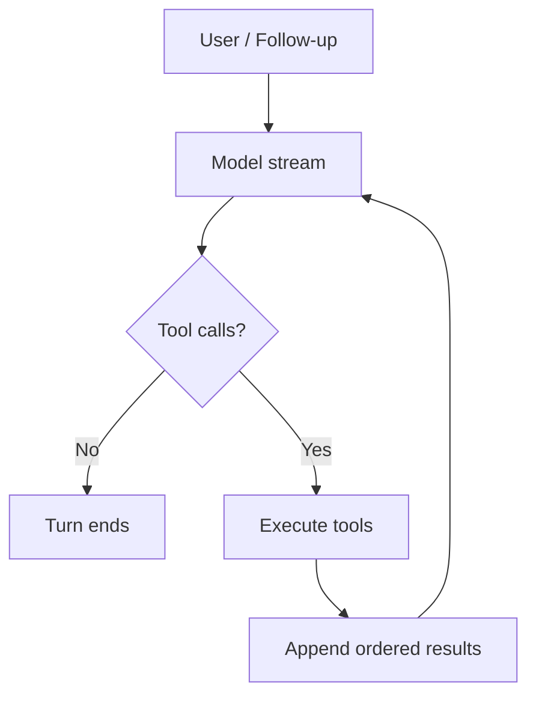

# Travis234 Book Authoring Implementation Plan

> **For agentic workers:** REQUIRED SUB-SKILL: Use superpowers:subagent-driven-development (recommended) or superpowers:executing-plans to implement this plan task-by-task. Steps use checkbox (`- [ ]`) syntax for tracking.

**Goal:** Publish a concise, source-backed Burmese sequel that teaches how Travis234 ports Pi's agent loop and Hermes Agent's compaction model into a coherent Python runtime.

**Architecture:** The repository separates manuscript chapters, evidence ledgers, executable teaching code and validation scripts. Part I establishes the two runtime problems, Parts II and III trace the Pi and Hermes ports, and Part IV joins them in an offline lab before documenting parity and intentional divergence.

**Tech Stack:** Markdown, Mermaid, Python 3.11+ standard library, `unittest`, Git, pinned GitHub source revisions.

## Global Constraints

- Write natural Burmese explanations while preserving English technical terms such as `Agent Loop`, `Tool Call`, `Context Window` and `Compaction`.
- Use the high-level teaching patterns observed on `se.saturngod.net`: problem-first openings, short-to-medium paragraphs, numbered subsections, concrete analogies and direct explanations. Do not imitate sentences or reproduce typos.
- Focus on the Pi agent loop and Hermes compaction ports. Provider catalogs, full TUI coverage and extension catalogs remain out of scope.
- Keep code excerpts short. Prefer original diagrams and executable simplified examples over copied source blocks.
- Label simplified lab code as educational. Do not present it as a second Travis234 implementation.
- Pin and cite these research revisions:
  - `htooayelwinict/Agentic-AI-Book@7eed5ca1c4b21ab766dda2df4e039ab745cdc30f`
  - `htooayelwinict/travis234@68b1831691b8ec93f9550ce63b80cdcb7a591b2e`
  - `earendil-works/pi@1f0dbc008c9b3e88017d42e8a1b46d416ad2b6b6`
  - `NousResearch/hermes-agent@af250d84948179834820a62bfd870c0df6f264a1`
- Treat parity counts as revision-specific evidence: Pi has 78 tracked contracts, 74 parity plus 4 intentional divergences; Hermes compaction has 11 tracked contracts marked parity.
- Do not claim the full Travis234 suite was rerun unless it is actually rerun. The locally executed acceptance manifest verification and repository-recorded full-suite result must be distinguished.
- Use CC BY-NC-SA 4.0 for the manuscript and retain MIT attribution for source material.
- Every chapter follows this learning sequence when applicable: Problem → Mental model → Source mapping → Execution flow → Small lab → Failure modes → Takeaways → Source notes.
- Run `python3 -m unittest discover -s tests -v` and `python3 scripts/check_book.py` before every manuscript milestone commit.

---

## Planned file structure

```text
Travis234-Book/
├── README.md
├── LICENSE
├── CONTRIBUTING.md
├── STYLE_GUIDE.md
├── GLOSSARY.md
├── THIRD_PARTY_NOTICES.md
├── book/
│   ├── README.md
│   ├── SUMMARY.md
│   ├── chapters/
│   │   ├── 00-preface-attribution.md
│   │   ├── 01-why-pi-and-hermes.md
│   │   ├── 02-pi-agent-loop-anatomy.md
│   │   ├── 03-typescript-to-python-semantic-port.md
│   │   ├── 04-tool-execution-bounded-concurrency.md
│   │   ├── 05-context-window-pressure.md
│   │   ├── 06-hermes-style-compaction.md
│   │   ├── 07-pi-meets-hermes.md
│   │   ├── 08-minimal-runtime-lab.md
│   │   ├── 09-parity-divergence-lessons.md
│   │   └── appendices/
│   │       ├── a-installation.md
│   │       ├── b-npm-docker-launcher.md
│   │       ├── c-source-map.md
│   │       └── d-glossary-references.md
│   └── references/
│       ├── CLAIM_LEDGER.md
│       └── SOURCE_MAP.md
├── examples/
│   └── minimal_runtime.py
├── scripts/
│   └── check_book.py
├── tests/
│   ├── test_check_book.py
│   └── test_minimal_runtime.py
└── docs/superpowers/
    ├── specs/2026-07-18-travis234-book-design.md
    └── plans/2026-07-18-travis234-book-authoring.md
```

### Task 1: Repository foundation and automated book checks

**Files:**

- Create: `README.md`
- Create: `CONTRIBUTING.md`
- Create: `STYLE_GUIDE.md`
- Create: `GLOSSARY.md`
- Create: `LICENSE`
- Create: `book/README.md`
- Create: `book/SUMMARY.md`
- Create: `scripts/check_book.py`
- Create: `tests/test_check_book.py`

**Interfaces:**

- Produces: `check_book(root: pathlib.Path) -> list[str]`, the canonical chapter ordering and the terminology rules used by all later tasks.
- Consumes: the approved design spec and the file structure above.

- [ ] **Step 1: Write failing validation tests**

Create `tests/test_check_book.py` with `unittest` cases that construct a temporary repository and assert that `check_book()` reports:

```python
from pathlib import Path
from tempfile import TemporaryDirectory
import unittest

from scripts.check_book import check_book


class CheckBookTests(unittest.TestCase):
    def test_reports_unresolved_placeholders(self) -> None:
        with TemporaryDirectory() as temp:
            root = Path(temp)
            chapter = root / "book" / "chapters" / "sample.md"
            chapter.parent.mkdir(parents=True)
            marker = "TO" + "DO"
            chapter.write_text(f"# Sample\n\n{marker}: explain this\n", encoding="utf-8")
            self.assertIn("unresolved placeholder", "\n".join(check_book(root)))

    def test_reports_broken_local_link(self) -> None:
        with TemporaryDirectory() as temp:
            root = Path(temp)
            chapter = root / "book" / "chapters" / "sample.md"
            chapter.parent.mkdir(parents=True)
            chapter.write_text("[missing](../missing.md)\n", encoding="utf-8")
            self.assertIn("broken local link", "\n".join(check_book(root)))


if __name__ == "__main__":
    unittest.main()
```

- [ ] **Step 2: Run the checker tests and confirm the expected failure**

Run: `python3 -m unittest tests.test_check_book -v`

Expected: `ModuleNotFoundError: No module named 'scripts.check_book'`.

- [ ] **Step 3: Implement the minimal checker**

Create `scripts/check_book.py` with:

```python
from __future__ import annotations

import re
import sys
from pathlib import Path

PLACEHOLDER_WORDS = ("TO" + "DO", "T" + "BD", "FIX" + "ME")
PLACEHOLDERS = re.compile(
    r"\b(" + "|".join(PLACEHOLDER_WORDS) + r")\b",
    re.IGNORECASE,
)
LINKS = re.compile(r"\[[^\]]+\]\(([^)]+)\)")


def check_book(root: Path) -> list[str]:
    errors: list[str] = []
    for path in sorted(root.rglob("*.md")):
        text = path.read_text(encoding="utf-8")
        if PLACEHOLDERS.search(text):
            errors.append(f"{path}: unresolved placeholder")
        for target in LINKS.findall(text):
            if target.startswith(("http://", "https://", "#", "mailto:")):
                continue
            local_target = target.split("#", 1)[0]
            if local_target and not (path.parent / local_target).resolve().exists():
                errors.append(f"{path}: broken local link: {target}")
    return errors


if __name__ == "__main__":
    failures = check_book(Path(__file__).resolve().parents[1])
    if failures:
        print("\n".join(failures))
        sys.exit(1)
    print("book checks passed")
```

- [ ] **Step 4: Run tests and confirm the checker passes**

Run: `python3 -m unittest tests.test_check_book -v`

Expected: two tests pass.

- [ ] **Step 5: Create the repository guidance files**

Write the root `README.md` with the approved title, a two-paragraph sequel description, audience, scope boundary, reading order and a link to `book/SUMMARY.md`. Write `STYLE_GUIDE.md` from section 6 of the design spec and include a terminology table with these canonical forms:

| Use | Avoid as the primary term |
|---|---|
| Agent Loop | Agent စက်ဝိုင်း |
| Tool Call | ကိရိယာခေါ်ဆိုမှု only |
| Tool Result | ကိရိယာရလဒ် only |
| Context Window | ဆက်စပ်အကြောင်းအရာ ပြတင်းပေါက် |
| Compaction | အပြည့်အဝ မြန်မာဘာသာပြန်ထားသော term |
| Bounded Concurrency | limit မရှင်းသော parallelism |

Write `book/SUMMARY.md` in the exact chapter order from the planned file structure. At this first milestone, list not-yet-created chapter paths as inline code; each later task converts its completed paths into links. `CONTRIBUTING.md` must require issue-first discussion for large manuscript rewrites and source-backed corrections. `GLOSSARY.md` begins with the six canonical terms above. `LICENSE` contains the CC BY-NC-SA 4.0 notice and canonical license link.

- [ ] **Step 6: Verify and commit the foundation**

Run: `python3 -m unittest discover -s tests -v && python3 scripts/check_book.py && git diff --check`

Expected: all tests pass, `book checks passed`, and no whitespace errors.

Commit: `git add README.md CONTRIBUTING.md STYLE_GUIDE.md GLOSSARY.md LICENSE book scripts tests && git commit -m "docs: establish Travis234 book foundation"`

### Task 2: Evidence ledger, source map and third-party notices

**Files:**

- Create: `THIRD_PARTY_NOTICES.md`
- Create: `book/references/SOURCE_MAP.md`
- Create: `book/references/CLAIM_LEDGER.md`
- Create: `book/chapters/appendices/c-source-map.md`
- Modify: `book/SUMMARY.md`

**Interfaces:**

- Produces: stable source IDs `T-*`, `P-*` and `H-*` referenced in chapter Source Notes.
- Consumes: pinned revisions from Global Constraints and the checked-out sibling repositories `../travis234`, `../pi-reference`, and `../hermes-reference`.

- [ ] **Step 1: Record exact source anchors**

Create `SOURCE_MAP.md` with these initial IDs:

| ID | Repository path | Purpose |
|---|---|---|
| T-LOOP | `travis/agent/agent_loop.py` | Python loop and event ordering |
| T-AGENT | `travis/agent/agent.py` | Runtime owner and public surface |
| T-TYPES | `travis/agent/types.py` | Python event/message/tool types |
| T-TOOLS | `travis/agent/tool_coordinator.py` | Bounded tool execution |
| T-COMPRESS | `travis/compaction/compressor.py` | Two-pass compression |
| T-POLICY | `travis/compaction/policy.py` | Threshold bands and token policy |
| T-TIMING | `travis/compaction/timing.py` | Compaction timing decisions |
| T-SESSION | `travis/coding_agent/agent_session.py` | Session integration |
| T-COORD | `travis/coding_agent/compaction_coordinator.py` | Preflight/post-response/overflow coordination |
| T-PARITY | `scripts/parity_contracts.py` | Pi/Hermes parity manifest |
| T-VERIFY | `scripts/verify_acceptance.py` | Acceptance verification entry point |
| P-LOOP | `packages/agent/src/agent-loop.ts` | Upstream Pi loop |
| P-TYPES | `packages/agent/src/types.ts` | Upstream Pi contracts |
| P-HARNESS | `packages/agent/src/harness/agent-harness.ts` | Upstream harness surface |
| H-COMPRESS | `agent/context_compressor.py` | Upstream Hermes context compressor |
| H-CONVERSATION | `agent/conversation_compression.py` | Compression workflow |
| H-CONTEXT | `agent/context_engine.py` | Context construction |

Every entry includes repository URL, pinned commit and a one-sentence evidence boundary.

- [ ] **Step 2: Create the claim ledger**

Create `CLAIM_LEDGER.md` with columns `Claim ID`, `Claim`, `Evidence`, `Verification`, and `Used in`. Seed it with:

- `C-LOOP-ORDER`: Travis preserves the outer follow-up loop and inner steering/tool loop structure.
- `C-RESULT-ORDER`: parallel tool completion does not change source-ordered tool results.
- `C-BOUND`: Travis intentionally bounds parallel tool execution.
- `C-PRUNE`: compaction pass 1 is deterministic pruning.
- `C-SUMMARY`: compaction pass 2 creates or updates a structured summary.
- `C-TAIL`: head messages plus a token-budgeted tail are retained.
- `C-TIMING`: compaction can run preflight, post-response, overflow and manually.
- `C-PARITY`: the pinned manifest records 74 Pi parity contracts, 4 Pi divergences and 11 Hermes parity contracts.

Each claim must cite at least one source ID. `C-PARITY` must say “manifest verified locally” and must not imply the full test suite was rerun.

- [ ] **Step 3: Verify the parity manifest**

Run: `python3 ../travis234/scripts/verify_acceptance.py --parity-json`

Expected: exit code 0 and JSON containing the Pi and Hermes contract summaries. If counts differ, update the design assumptions, ledger and subsequent prose before continuing.

- [ ] **Step 4: Write attribution and public appendix**

`THIRD_PARTY_NOTICES.md` must identify Pi, Hermes Agent and Travis234 as MIT-licensed source projects and link to their repositories and license files. `c-source-map.md` explains why the book pins revisions, links to the internal `SOURCE_MAP.md`, and warns that line numbers may drift on newer upstream revisions.

Convert the Source Map appendix entry in `book/SUMMARY.md` into a link.

- [ ] **Step 5: Verify and commit evidence controls**

Run: `python3 scripts/check_book.py && git diff --check`

Expected: `book checks passed` and no whitespace errors.

Commit: `git add THIRD_PARTY_NOTICES.md book/references book/chapters/appendices/c-source-map.md book/SUMMARY.md && git commit -m "docs: add source and attribution ledger"`

### Task 3: Preface and the Pi-plus-Hermes problem statement

**Files:**

- Create: `book/chapters/00-preface-attribution.md`
- Create: `book/chapters/01-why-pi-and-hermes.md`
- Modify: `book/README.md`
- Modify: `book/SUMMARY.md`
- Modify: `book/references/CLAIM_LEDGER.md`

**Interfaces:**

- Produces: reader contract and the “action continuity” mental model used by all technical chapters.
- Consumes: `T-LOOP`, `T-COMPRESS`, `P-LOOP`, `H-COMPRESS` and the original book's tone guidance.

- [ ] **Step 1: Draft Chapter 00**

Use these exact top-level subsections:

1. `ဒီစာအုပ်ကို ဘာကြောင့် ဆက်ရေးတာလဲ`
2. `ဘယ်သူတွေ ဖတ်သင့်လဲ`
3. `ဘာတွေ မပါဘူးလဲ`
4. `Source Code ကို ဘယ်လိုဖတ်မလဲ`
5. `Attribution နှင့် License`
6. `ဒီစာအုပ်ကို ဘယ်လိုဖတ်မလဲ`

State that this is a sequel, not a replacement for `Agentic-AI-Book`. Explain that behavior is taught before implementation detail. Include the pinned revision table and link to `THIRD_PARTY_NOTICES.md`.

- [ ] **Step 2: Draft Chapter 01 around one concrete failure**

Open with an agent that can call tools correctly but loses the reason for its work after the conversation grows. Use the analogy “လုပ်ဆောင်နိုင်တဲ့လက်” for the loop and “ဆက်လုပ်ဖို့လိုတဲ့မှတ်စု” for compaction, while clearly labeling the analogy as incomplete.

Use these subsections:

1. `Tool သုံးတတ်ရုံနဲ့ Agent Runtime မပြည့်စုံသေးဘူး`
2. `Pi က ဖြေရှင်းပေးတဲ့ ပြဿနာ`
3. `Hermes က ဖြေရှင်းပေးတဲ့ ပြဿနာ`
4. `Travis234 မှာ နှစ်ခု ဘယ်လိုဆုံသလဲ`
5. `မရောထွေးသင့်တဲ့ အရာများ`
6. `အနှစ်ချုပ်`
7. `Source Notes`

The “မရောထွေးသင့်” section distinguishes context from long-term memory and compaction from raw truncation.

- [ ] **Step 3: Add evidence links and reading navigation**

Map runtime claims to `C-LOOP-ORDER`, `C-PRUNE`, `C-SUMMARY` and `C-TIMING`. Add Previous/Next links, convert the completed Chapter 00 and 01 entries in `book/SUMMARY.md` into links, and update `book/README.md` with Part I status.

- [ ] **Step 4: Verify and commit Part I**

Run: `python3 -m unittest discover -s tests -v && python3 scripts/check_book.py && git diff --check`

Expected: all checks pass.

Commit: `git add book && git commit -m "docs: draft Travis234 sequel introduction"`

### Task 4: Benchmark chapter — Pi Agent Loop Anatomy

**Files:**

- Create: `book/chapters/02-pi-agent-loop-anatomy.md`
- Modify: `book/SUMMARY.md`
- Modify: `book/references/CLAIM_LEDGER.md`

**Interfaces:**

- Produces: the approved voice/depth benchmark and event vocabulary for Chapters 03, 04, 07 and 08.
- Consumes: `P-LOOP`, `P-TYPES`, `T-LOOP`, `T-TYPES`, `C-LOOP-ORDER`, and `C-RESULT-ORDER`.

- [ ] **Step 1: Build the source-to-concept table**

The chapter includes this mapping before code excerpts:

| Concept | Pi | Travis234 |
|---|---|---|
| Outer follow-up loop | `packages/agent/src/agent-loop.ts` | `travis/agent/agent_loop.py` |
| Inner steering/tool loop | same | same |
| Runtime types | `packages/agent/src/types.ts` | `travis/agent/types.py` |
| Agent owner | `packages/agent/src/agent.ts` | `travis/agent/agent.py` |

- [ ] **Step 2: Draft the execution narrative**

Use these subsections:

1. `Agent Loop ဆိုတာ while loop တစ်ခုတည်း မဟုတ်ဘူး`
2. `Outer Loop — Follow-up ကို ထိန်းတဲ့အပိုင်း`
3. `Inner Loop — Steering နဲ့ Tool Execution`
4. `Assistant Stream က Event ဘယ်လိုဖြစ်လာသလဲ`
5. `Tool Result ပြန်ဝင်လာတဲ့အစီအစဉ်`
6. `ဘယ်အချိန်မှာ Loop ရပ်သလဲ`
7. `Failure Modes`
8. `အနှစ်ချုပ်`
9. `Source Notes`

Explain one full turn from user input through assistant stream, tool call, tool result and the next model call. Explicitly separate event emission order from wall-clock completion order.

- [ ] **Step 3: Add one compact flow diagram**

Use a top-down Mermaid flow with no more than five nodes per row:



Explain that the diagram omits cancellation, hooks and validation, which Chapter 04 adds.

Convert the Chapter 02 entry in `book/SUMMARY.md` into a link after the chapter file exists.

- [ ] **Step 4: Run the benchmark review gate**

Check the chapter against `STYLE_GUIDE.md` and verify that it contains one problem opening, one mental model, one source map, one flow, two failure modes, takeaways and source notes. Present this chapter to the author as the tone and depth benchmark before drafting Chapters 03–09.

- [ ] **Step 5: Verify and commit the benchmark**

Run: `python3 scripts/check_book.py && git diff --check`

Expected: all checks pass.

Commit: `git add book/chapters/02-pi-agent-loop-anatomy.md book/references/CLAIM_LEDGER.md book/SUMMARY.md && git commit -m "docs: explain the Pi agent loop port"`

### Task 5: Semantic porting and bounded tool execution

**Files:**

- Create: `book/chapters/03-typescript-to-python-semantic-port.md`
- Create: `book/chapters/04-tool-execution-bounded-concurrency.md`
- Modify: `book/SUMMARY.md`
- Modify: `book/references/CLAIM_LEDGER.md`

**Interfaces:**

- Produces: the Python adaptation model and bounded-concurrency vocabulary used by the lab.
- Consumes: `P-LOOP`, `P-HARNESS`, `T-LOOP`, `T-TYPES`, `T-TOOLS`, `C-RESULT-ORDER`, and `C-BOUND`.

- [ ] **Step 1: Draft Chapter 03 as a semantic comparison**

Cover the exact comparisons below:

| TypeScript concept | Python adaptation | Invariant to preserve |
|---|---|---|
| Promise/async function | coroutine/`await` | completion and error semantics |
| event callback/stream | async iterator/event objects | event order |
| interface/type aliases | dataclasses/protocol-like contracts | message shape |
| AbortSignal | Python abort signal abstraction | cooperative cancellation |
| TS harness signature | Pythonic async harness | behavior, not syntax |

Subsections end with the warning that a line-for-line port can still be behaviorally wrong.

- [ ] **Step 2: Draft Chapter 04 around the out-of-order completion problem**

Start with two tools where the second finishes first. Explain sequential mode, eligible parallel mode, validation before execution, before/after hooks, cancellation and result ordering. State that Travis234's bounded parallelism is one of the four intentional Pi divergences.

Include a table distinguishing:

| Order | Meaning |
|---|---|
| Source order | tool calls as produced by the model |
| Start order | tasks admitted by the coordinator |
| Completion order | wall-clock completion |
| Result order | messages appended back into context |

- [ ] **Step 3: Add failure modes and evidence**

Chapter 03 includes accidental exception swallowing and cancellation drift. Chapter 04 includes unbounded fan-out, unsafe parallel mutation, and completion-order result corruption. Map all claims through the claim ledger.

Convert the Chapter 03 and 04 entries in `book/SUMMARY.md` into links.

- [ ] **Step 4: Verify and commit Part II**

Run: `python3 scripts/check_book.py && git diff --check`

Expected: all checks pass.

Commit: `git add book/chapters/03-typescript-to-python-semantic-port.md book/chapters/04-tool-execution-bounded-concurrency.md book/references/CLAIM_LEDGER.md book/SUMMARY.md && git commit -m "docs: cover Python porting and tool concurrency"`

### Task 6: Context pressure and Hermes-style compaction

**Files:**

- Create: `book/chapters/05-context-window-pressure.md`
- Create: `book/chapters/06-hermes-style-compaction.md`
- Modify: `book/SUMMARY.md`
- Modify: `book/references/CLAIM_LEDGER.md`

**Interfaces:**

- Produces: compaction vocabulary and two-pass model used in integration and lab chapters.
- Consumes: `H-COMPRESS`, `H-CONVERSATION`, `H-CONTEXT`, `T-COMPRESS`, `T-POLICY`, `T-TIMING`, `C-PRUNE`, `C-SUMMARY`, and `C-TAIL`.

- [ ] **Step 1: Draft Chapter 05 with a growing tool-output example**

Explain why context grows faster than visible chat when tool results, arguments and images are included. Distinguish model context capacity, reserved output space, estimated tokens and overflow. Compare four strategies: do nothing, drop oldest messages, raw truncation and structured compaction.

- [ ] **Step 2: Draft Chapter 06 as a two-pass pipeline**

Use this structure:

1. `Compaction က Delete လုပ်တာမဟုတ်ဘူး`
2. `Pass 1 — Deterministic Pruning`
3. `Pass 2 — Structured Summary`
4. `Summary အသစ်နဲ့ Summary Update`
5. `Head + Token-budgeted Tail`
6. `Threshold Bands နှင့် Anti-thrashing`
7. `ဘာတွေ ဆုံးရှုံးနိုင်သလဲ`
8. `အနှစ်ချုပ်`
9. `Source Notes`

Pass 1 covers tool-output deduplication, old tool-result summarization, image removal and argument truncation. Pass 2 distinguishes summary-from-scratch from iterative summary update. Explain output-reserved threshold bands without presenting one threshold as universally correct.

- [ ] **Step 3: Add one before/after context table**

Show a synthetic context containing system instructions, initial goal, four tool calls, large tool outputs and the newest user turn. The compacted side retains the head, a structured summary and a recent tail. Mark the example as conceptual, not exact token output.

Convert the Chapter 05 and 06 entries in `book/SUMMARY.md` into links.

- [ ] **Step 4: Verify and commit Part III**

Run: `python3 scripts/check_book.py && git diff --check`

Expected: all checks pass.

Commit: `git add book/chapters/05-context-window-pressure.md book/chapters/06-hermes-style-compaction.md book/references/CLAIM_LEDGER.md book/SUMMARY.md && git commit -m "docs: explain Hermes-style context compaction"`

### Task 7: Integrate the loop and compaction lifecycle

**Files:**

- Create: `book/chapters/07-pi-meets-hermes.md`
- Modify: `book/SUMMARY.md`
- Modify: `book/references/CLAIM_LEDGER.md`

**Interfaces:**

- Produces: lifecycle model consumed by the minimal runtime lab.
- Consumes: `T-SESSION`, `T-COORD`, `T-TIMING`, `C-TIMING` and the concepts established in Chapters 02 and 06.

- [ ] **Step 1: Draft the four compaction entry paths**

Explain:

- preflight compaction before a model request,
- post-response compaction after a successful turn,
- overflow recovery after capacity failure,
- explicit manual compaction.

For each path state its trigger, what context it sees, what is persisted and how normal loop execution resumes.

- [ ] **Step 2: Add a compact sequence diagram**

Use four participants: `User`, `AgentSession`, `Agent Loop`, and `Compactor`. Show preflight, model/tool work, post-response evaluation and continuation. Put overflow recovery in a separate small flowchart so the normal path stays readable.

- [ ] **Step 3: Document lifecycle failure modes**

Cover compaction on every turn, repeated summary rewrites, stale persisted context, retry loops after overflow and manual compaction racing with an active run. Do not claim a guarantee unless it is present in the pinned source or tests.

Convert the Chapter 07 entry in `book/SUMMARY.md` into a link.

- [ ] **Step 4: Verify and commit integration chapter**

Run: `python3 scripts/check_book.py && git diff --check`

Expected: all checks pass.

Commit: `git add book/chapters/07-pi-meets-hermes.md book/references/CLAIM_LEDGER.md book/SUMMARY.md && git commit -m "docs: connect loop and compaction lifecycles"`

### Task 8: Build and document the offline minimal runtime lab

**Files:**

- Create: `examples/minimal_runtime.py`
- Create: `tests/test_minimal_runtime.py`
- Create: `book/chapters/08-minimal-runtime-lab.md`
- Modify: `book/SUMMARY.md`

**Interfaces:**

- Produces:
- `ToolCall(id: str, name: str, arguments: dict[str, object], parallel: bool)`
- `AssistantTurn(text: str, tool_calls: tuple[ToolCall, ...])`
- `RuntimeEvent(kind: str, detail: str)`
- `Model = Callable[[list[dict[str, object]]], Awaitable[AssistantTurn]]`
- `Tool = Callable[[dict[str, object]], Awaitable[str]]`
- `run_agent_loop(model, tools, user_input, *, max_iterations=8, max_parallel_tools=4) -> list[RuntimeEvent]`
- Consumes: the event ordering, bounded concurrency and simplified compaction lifecycle described in Chapters 02, 04, 06 and 07.

- [ ] **Step 1: Write the failing event-order test**

Create an `IsolatedAsyncioTestCase` using a fake model that first returns two parallel tool calls and then a final answer. The first tool sleeps longer than the second. Assert:

```python
self.assertEqual(
    [event.kind for event in events],
    [
        "assistant_start",
        "assistant_end",
        "tool_start",
        "tool_start",
        "tool_end",
        "tool_end",
        "assistant_start",
        "assistant_end",
    ],
)
self.assertEqual(
    [event.detail for event in events if event.kind == "tool_end"],
    ["slow:slow-result", "fast:fast-result"],
)
```

This asserts source-ordered results even though the fast tool completes first.

- [ ] **Step 2: Run the event-order test and confirm failure**

Run: `python3 -m unittest tests.test_minimal_runtime -v`

Expected: import failure because `examples/minimal_runtime.py` does not exist.

- [ ] **Step 3: Implement the smallest educational loop**

Implement immutable dataclasses, a tool lookup, `asyncio.Semaphore(max_parallel_tools)`, `asyncio.gather()` for parallel calls and an iteration ceiling. Emit assistant boundary events around each fake model call. Emit `tool_start` events in source order before scheduling eligible parallel work, then emit `tool_end` events from the source-ordered result list returned by `gather()`. Execute non-parallel calls sequentially. Raise `KeyError` for an unknown tool and `RuntimeError` when `max_iterations` is exhausted.

- [ ] **Step 4: Add bounded-concurrency and failure tests**

Add tests that:

- track active tool count and assert the peak never exceeds `max_parallel_tools=2`;
- assert an unknown tool raises `KeyError("unknown tool: missing")`;
- assert a model that always calls a tool hits `RuntimeError("iteration limit reached")`.

- [ ] **Step 5: Run the complete lab test suite**

Run: `python3 -m unittest tests.test_minimal_runtime -v`

Expected: four tests pass without network access or API keys.

- [ ] **Step 6: Draft Chapter 08 around the executable example**

Label the code as a teaching model. Walk through the dataclasses, fake model, tool coordinator, source-ordered results and iteration limit. Add commands:

```bash
python3 examples/minimal_runtime.py
python3 -m unittest tests.test_minimal_runtime -v
```

Show the exact expected event kinds from Step 1. End with a “What Travis234 adds” table covering streaming richness, hooks, validation, cancellation, session persistence and real compaction.

Convert the Chapter 08 entry in `book/SUMMARY.md` into a link.

- [ ] **Step 7: Verify and commit the lab**

Run: `python3 -m unittest discover -s tests -v && python3 scripts/check_book.py && git diff --check`

Expected: all tests and book checks pass.

Commit: `git add examples tests book/chapters/08-minimal-runtime-lab.md book/SUMMARY.md && git commit -m "feat: add offline agent runtime lab"`

### Task 9: Parity lessons and practical appendices

**Files:**

- Create: `book/chapters/09-parity-divergence-lessons.md`
- Create: `book/chapters/appendices/a-installation.md`
- Create: `book/chapters/appendices/b-npm-docker-launcher.md`
- Create: `book/chapters/appendices/d-glossary-references.md`
- Modify: `GLOSSARY.md`
- Modify: `book/SUMMARY.md`
- Modify: `book/references/CLAIM_LEDGER.md`

**Interfaces:**

- Produces: the publication-facing boundary between faithful porting, intentional adaptation and operational guidance.
- Consumes: `T-PARITY`, `T-VERIFY`, Travis234 `NOTICE.md`, `LICENSE`, launcher source and verification docs.

- [ ] **Step 1: Draft Chapter 09 from the manifest rather than marketing language**

Explain behavioral parity, mechanical similarity and intentional divergence as different ideas. Include all four Pi divergences:

1. bounded parallelism;
2. project package mutation fails closed pending trust;
3. unknown projects fail closed in non-interactive mode;
4. Pythonic async `AgentHarness` instead of a TypeScript signature clone.

State that the pinned Hermes manifest contains 11 parity contracts. Explain what contracts can and cannot prove.

- [ ] **Step 2: Write installation appendix**

Use commands confirmed by the pinned Travis234 `README.md` or packaging metadata. Separate source installation from the npm launcher. Do not invent supported Python or Node version floors; quote only values present in source metadata.

- [ ] **Step 3: Write npm Docker launcher appendix with bounded claims**

Include:

```bash
npx @htooayelwinict/travis234 --cwd .
```

Explain that the launcher mounts the selected workspace read-write and isolates Travis234 state. Document the observed controls: `--cap-drop ALL`, `no-new-privileges`, host UID/GID, PID limit 512 and optional `--no-network`. State plainly that network is enabled by default and that these controls do not constitute a complete security boundary.

- [ ] **Step 4: Finish glossary and references**

Expand `GLOSSARY.md` with terms introduced in Chapters 02–09. `d-glossary-references.md` links to the root glossary, upstream repositories, licenses and the Saturngod Software Engineering pages used only as high-level writing references.

Convert the Chapter 09 and all appendix entries in `book/SUMMARY.md` into links. Confirm that every entry is now a link to an existing file.

- [ ] **Step 5: Verify and commit closing material**

Run: `python3 ../travis234/scripts/verify_acceptance.py --parity-json && python3 -m unittest discover -s tests -v && python3 scripts/check_book.py && git diff --check`

Expected: parity verification exits 0 and local tests/book checks pass.

Commit: `git add book GLOSSARY.md && git commit -m "docs: document parity and operational appendices"`

### Task 10: End-to-end editorial and technical verification

**Files:**

- Modify: all manuscript and navigation files as required by verified findings
- Create: `book/REVIEW_REPORT.md`

**Interfaces:**

- Produces: a release-candidate manuscript and an auditable review report.
- Consumes: all chapters, tests, source ledgers and quality gates.

- [ ] **Step 1: Run structural checks**

Run:

```bash
python3 -m unittest discover -s tests -v
python3 scripts/check_book.py
git diff --check
```

Expected: all commands pass.

- [ ] **Step 2: Audit every claim ID**

For each `CLAIM_LEDGER.md` row, open the pinned source and confirm that the prose stays within the evidence boundary. Record `verified`, `corrected`, or `removed` in `book/REVIEW_REPORT.md`. Refresh parity counts only through `scripts/verify_acceptance.py --parity-json`.

- [ ] **Step 3: Run a terminology and grammar pass**

Check every chapter against `STYLE_GUIDE.md`. Standardize English technical terms, Burmese punctuation and spacing. Remove robotic translation, repeated filler and sentence structures that imitate the reference website too closely. Preserve the author's Burmese-first voice.

- [ ] **Step 4: Run the scope-reduction pass**

Remove details that do not help readers understand the Pi loop port, Hermes compaction port or their integration. Provider catalogs, full command listings and extension inventories remain links or one-paragraph side notes.

- [ ] **Step 5: Verify navigation and runnable examples**

Open every local link from `README.md` and `book/SUMMARY.md`. Run:

```bash
python3 examples/minimal_runtime.py
python3 -m unittest tests.test_minimal_runtime -v
```

Confirm the printed event order matches Chapter 08.

- [ ] **Step 6: Write the review report**

`book/REVIEW_REPORT.md` records:

- pinned revisions;
- commands actually run and their results;
- claims corrected or narrowed;
- chapters receiving grammar edits;
- remaining publication caveats;
- explicit statement whether the full Travis234 suite was or was not rerun.

- [ ] **Step 7: Final verification and commit**

Run: `python3 -m unittest discover -s tests -v && python3 scripts/check_book.py && git diff --check && git status --short`

Expected: tests and checks pass; status contains only intended review changes.

Commit: `git add README.md STYLE_GUIDE.md GLOSSARY.md THIRD_PARTY_NOTICES.md book examples scripts tests && git commit -m "docs: complete Travis234 book review pass"`

## Execution checkpoints

1. Review after Task 4: approve the Chapter 02 tone and technical depth benchmark.
2. Review after Task 6: approve the complete Pi/Hermes explanatory core.
3. Review after Task 9: approve the full manuscript before the final QA pass.

No later checkpoint should silently rewrite already approved author voice; corrections should be source-backed, small and recorded in the review report.
